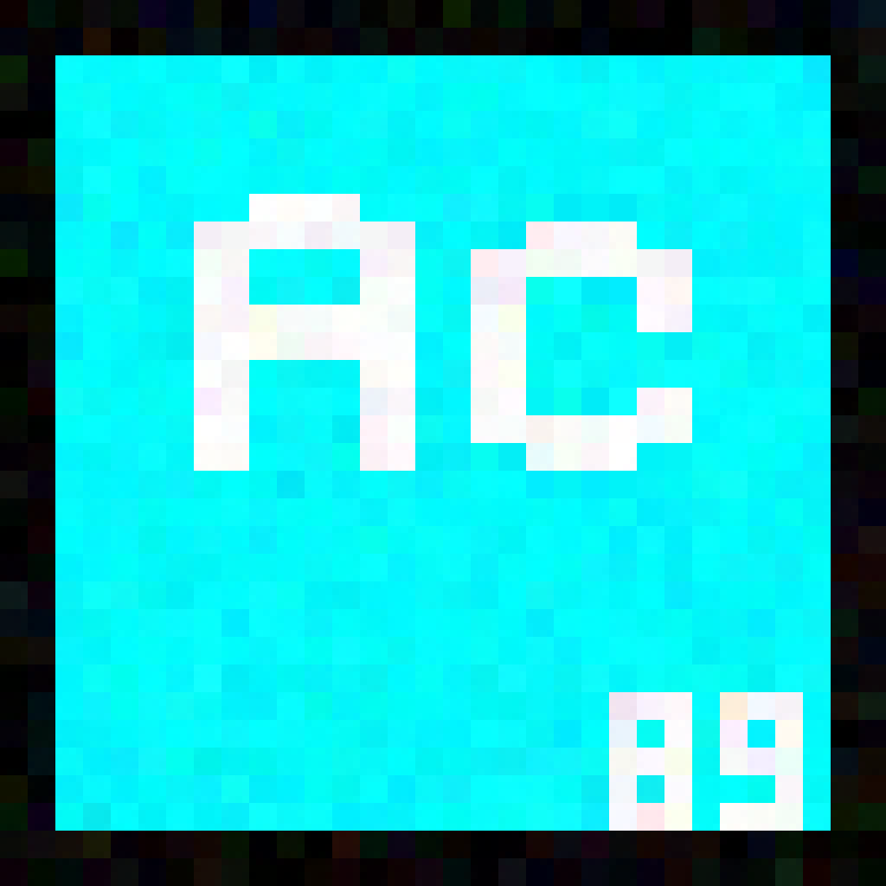

<div align="center">



Logo credits to @AveryDoesMagic

# Actinium

**⚠️ Actinium is currently in development.**

[](https://github.com/SyrupStudio/Actinium/releases)
[](https://opensource.org/licenses/MPL-2.0)
[](https://github.com/SyrupStudio/Actinium/issues)
[](https://github.com/SyrupStudio/Actinium/commits/main)
[](https://www.rust-lang.org/)
[](#compiling)

</div>

## About

Actinium is a game engine written in Rust and designed for building 2D and 3D games with a modern rendering stack and scripting capabilities.

---

## Compiling

### Prerequisites

- Git
- Rust toolchain (stable)
- A decentish computer
-  Pancakes (totally necessary)

### 1) Clone the repo

```bash
git clone https://github.com/SyrupStudio/Actinium.git
cd Actinium
```

### 2) Build

```bash
cargo build.yml
```

### 3) Run

```bash
cargo run --bin Actinium
```

### Optional development checks

```bash
cargo check
cargo test
```

---

## License Acknowledgements

This project is licensed under the Mozilla Public License 2.0. See [LICENSE](LICENSE) for the full license text.

This project uses the following third-party components:

- Rust — licensed under the MIT License and Apache License 2.0. See https://www.rust-lang.org/policies/licenses
- `wgpu` — licensed under the MIT License / Apache 2.0 terms. See https://github.com/gfx-rs/wgpu/blob/trunk/LICENSE-MIT and https://github.com/gfx-rs/wgpu/blob/trunk/LICENSE-APACHE
- `egui` — licensed under the MIT License and Apache License 2.0. See https://github.com/emilk/egui/blob/master/LICENSE-MIT
- `mlua` — licensed under the MIT License. See https://github.com/khvzak/mlua/blob/master/LICENSE
- Lua / LuaJIT — licensed under the MIT License / Lua License terms. See https://opensource.org/licenses/MIT and https://luajit.org/license.html

Where applicable, the licensing terms for downstream dependencies are included or referenced by their upstream projects. Please review the relevant licenses before redistribution or commercial use.

---
